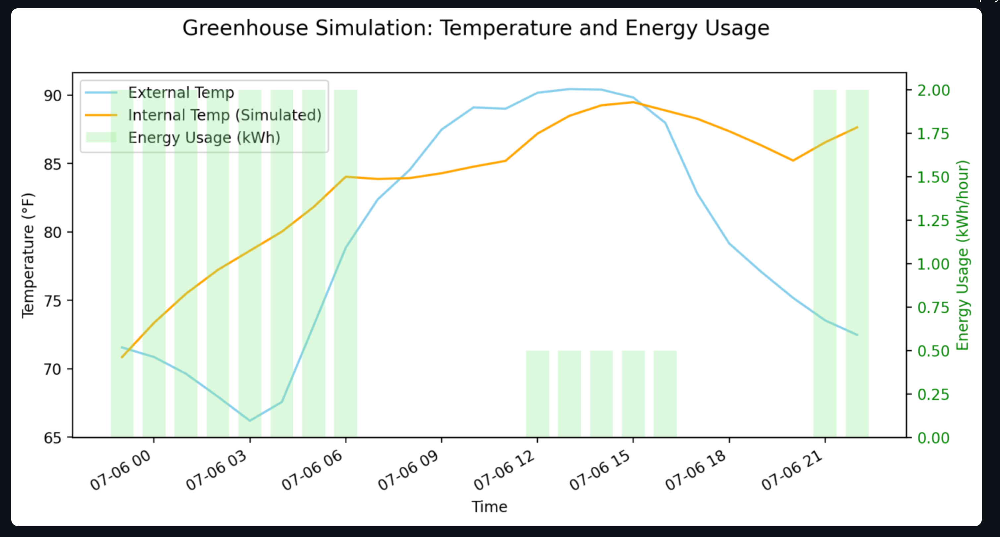

# Greenhouse Resource Optimization Digital Twin

  
*A real-time dashboard that simulates greenhouse conditions and recommends energy-efficient actions for farmers.*

---

This project simulates and forecasts the internal climate of a greenhouse to help small local growers—particularly the Sankofa farmer community in Pittsburgh—optimize resource use and maintain ideal growing conditions.

It combines a simulation-based **digital twin**, real weather forecasts, and machine learning models to predict future temperature behavior and recommend heating and venting actions.

## Objectives

* Develop a lightweight simulation model (digital twin) of greenhouse temperature and humidity behavior.
* Integrate real-time weather forecast data using the OpenWeatherAPI.
* Use **TensorFlow regression** to predict the greenhouse's internal temperature 12 hours ahead.
* Use **TensorFlow classifiers** to predict when heating or venting should be turned on or off to keep conditions optimal.
* Build a dashboard to visualize the predicted internal climate, recommended control actions, and estimated energy costs.

## Tech Stack

* Python
* TensorFlow (regression and classifier models)
* Scikit-learn (feature scaling and evaluation)
* Streamlit (interactive dashboard)
* OpenWeatherAPI (weather forecast data)
* Matplotlib and Seaborn (visualizations)
* Pandas and NumPy (data processing and simulation)

## Why this project matters

Small urban and peri-urban greenhouses often lack affordable tools to plan ahead for changing weather conditions and to track resource costs. This digital twin demonstrates how **machine learning and simulation** can make local food production more resilient and sustainable—even without large-scale commercial greenhouse systems.

The project is designed to be understandable, adaptable, and deployable by student engineers and local growers who may not have access to complex systems.

---

## 🚀 Getting Started

```bash
pip install -r requirements.txt
streamlit run app.py
