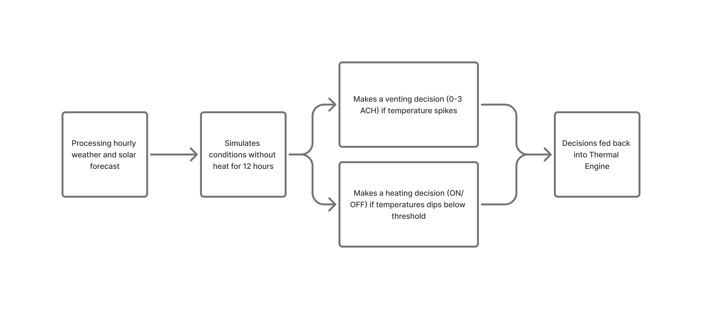
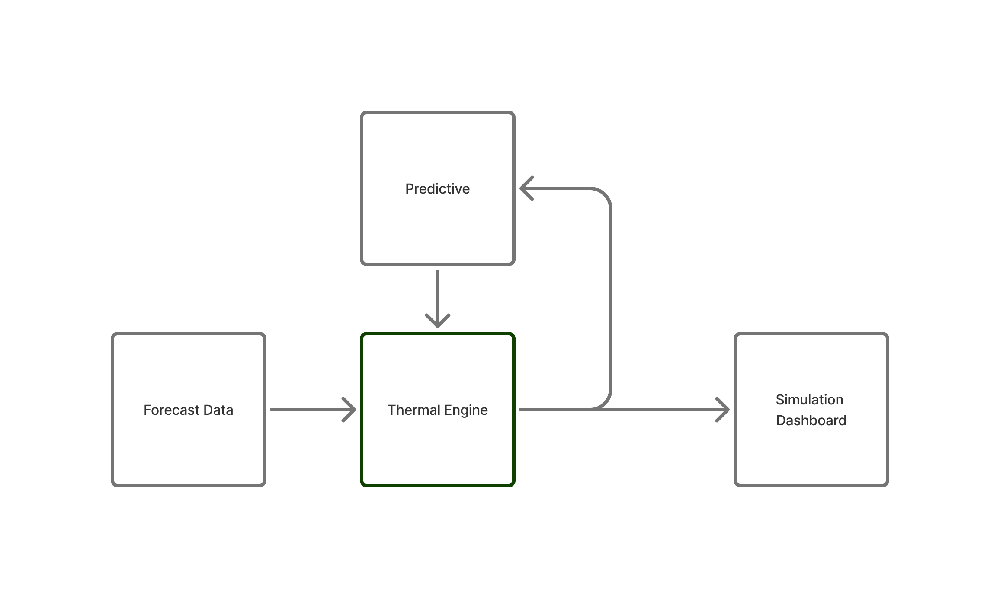
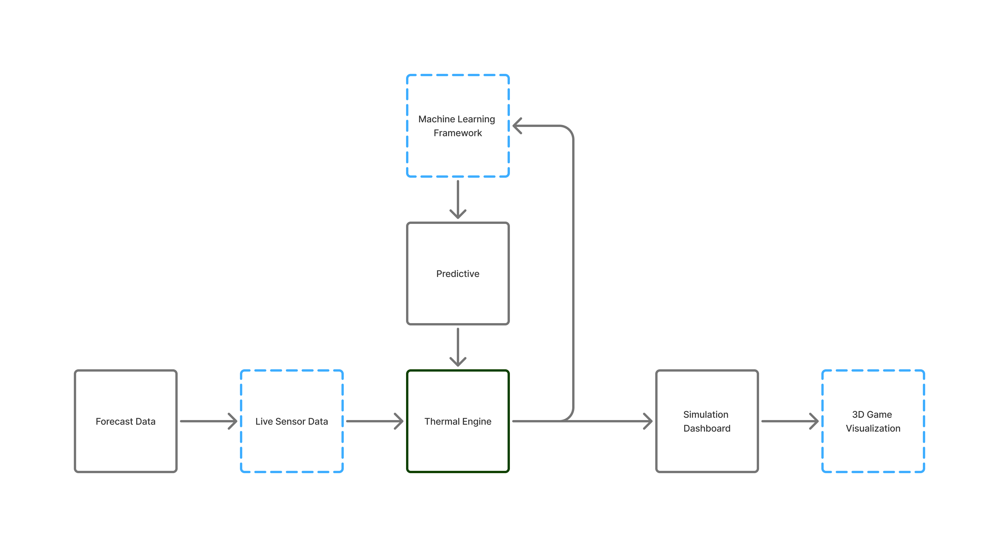

# Greenhouse Thermal Twin: Predictive Simulation for Resource Optimization

## Problem Statement

This project develops a computational **digital twin** of a bamboo-framed greenhouse, simulating internal thermal dynamics based on forecasted weather and solar data.
By integrating real-time weather APIs with a physically informed heat-transfer model, the system predicts air temperature, thermal mass behavior, ventilation rates, and energy usage over the coming hours.

The goal is to **support resource-efficient greenhouse operation** by forecasting when heating, ventilation, or passive solar gain will maintain optimal growing conditions — before those conditions are reached.

<video width="600" height="360" controls>
   <source src="Streamlit.mp4" type="video/mp4">
</video>

## Motivation

Greenhouses operate in a delicate thermal balance. Over-venting wastes energy; under-venting risks plant health.
Traditional control is reactive — waiting until temperatures breach thresholds. This project adds a **predictive layer**, using short-term weather forecasts and thermal mass modeling to make smarter control decisions.

For growers, educators, and researchers, this enables:

* **Energy savings** via proactive control
* **Crop protection** during extreme weather
* **Educational insight** into the physics of greenhouse environments

Like an architect’s 3D model, this thermal twin allows stakeholders to **experience and evaluate performance before reality**.

## Tech Stack

| Layer               | Technology                       | Description                                                                      |
| ------------------- | -------------------------------- | -------------------------------------------------------------------------------- |
| **Frontend**        | **Streamlit**                    | Interactive dashboard for running simulations and visualizing forecasts          |
| **Data Sources**    | **OpenWeather API**              | Hourly forecast for temperature, humidity, wind, and cloud cover                 |
|                     | **PVLib**                        | Solar position and irradiance model (GHI, DNI, DHI)                              |
| **Backend**         | **Python**                       | Core simulation engine and data processing                                       |
|                     | **Pandas / NumPy**               | Time-series handling and numerical calculations                                  |
| **Simulation Core** | Custom `GreenhouseThermalEngine` | Models conduction, infiltration, ventilation, heating, and thermal mass exchange |
| **Control Logic**   | Custom `Predictive` controller   | Decides heater and vent settings based on forecast trajectory                    |
| **Visualization**   | **Altair**                       | Multi-series charts for temperature, ventilation, solar, and energy metrics      |
| **Export**          | `.csv`                           | Raw simulation outputs for further analysis                                      |

## Algorithmic Overview

### 1. Heat Loss Calculation

**Purpose**: Computes conductive and infiltration losses based on envelope UA values and leakage ACH.

* **Strengths**: Physics-based; scales with wind speed for infiltration.
* **Limitations**: Assumes uniform air temperature distribution.

### 2. Solar Gain Calculation

**Purpose**: Uses PVLib’s irradiance models to determine incident solar on greenhouse surfaces, applying glazing transmission and SHGC.

* **Strengths**: Weather-driven and geometry-aware.
* **Limitations**: Ignores shading from nearby objects.

### 3. Thermal Mass Coupling

**Purpose**: Models energy storage and release between structural/soil mass and the air volume.

* **Strengths**: Captures day–night lag in air temperature.
* **Limitations**: Single-node mass model; no vertical stratification.

---

## Control Logic Walkthrough — `Predictive.decide`

The **`Predictive.decide`** method is the brain of the system — determining, hour by hour, whether the heater and vents should be engaged based on *both current conditions and the short-term forecast*.

**Step-by-Step Process**

1. **Forecast Ingestion**
   Receives a slice of the forecast containing:

   * Outside temperature (`T_ext`)
   * Solar input (`Q_solar`)

2. **No-Heat Trajectory Prediction**

   * Simulates greenhouse air temperature for the next `H` hours assuming the heater stays **off**.
   * Uses an exponential RC model with the greenhouse’s heat capacity (`C_J_K`) and conductance (`U_W_K`).
   * Solar gains are added as a direct input term.

3. **Comfort Bands and Thresholds**

   * Defines a **low band** = setpoint − (deadband/2) − safety margin
   * Defines a **high band** = setpoint + (deadband/2) + buffer

4. **Heating Decision**

   * If predicted temps will drop below the low band within the **lead time** (`tau`-based), enable **preheat**.
   * Apply **hysteresis**:

     * Turn on below `setpoint − deadband/2`
     * Turn off above `setpoint + deadband/2`
   * Respect **minimum on/off timers** to prevent short-cycling.

5. **Venting Decision**

   * Calculates **temperature error** above the high band.
   * Ventilation rate is **proportional** to that error (up to `vent_max_ach`).
   * **Hot-outside guard**: reduce venting if outside is hotter than inside.
   * **Night purge**: if outside is cooler and sun is down, allow a small purge rate.
   * **Predictive warm spike**: if the no-heat forecast shows overheating soon, ramp vents early.

6. **Outputs**
   Returns:

   * `heater_on` (bool)
   * `part_load` (fractional heater output; currently 0 or 1)
   * `vent_ach` (active air changes per hour)

**Example Flow**

* **Early morning**: Forecast shows temps dipping below setpoint → preheat kicks in before drop occurs.
* **Midday sun**: Interior warms past comfort → vents open proportionally, reduced if outside hotter.
* **Evening**: Sun sets, outside cools → small night purge to remove excess heat.

---

## Modular Simulation Design

The system is implemented as a **modular pipeline**, allowing each physical process to be tuned independently:

* Weather & solar data retrieval (`forecast.py`)
* Thermal mass modeling (`ThermalMass.py`)
* Heat transfer calculations (`GreenhouseThermalEngine`)
* Predictive decision logic (`Predictive`)
* Frontend dashboard (`streamlit_app.py`)

This separation allows easy swapping of control algorithms or testing different physical assumptions.

## Demo & Interface

* 🌤 **Run Simulation**: Select location and horizon, fetch forecast, and simulate.
* 📈 **Charts**: View predicted air temperature, thermal mass, exterior temperature, venting rate, heater status, and solar input.
* 💰 **Energy Metrics**: Estimated kWh and cost over the simulated period.
* 📄 **Raw Data**: Download CSV for offline analysis.

---

## Future Work

Present Flowchart

Proposed Future Direction

* Humidity and CO₂ modeling for plant health optimization
* Multi-zone thermal modeling with stratification
* Machine-learning-assisted parameter tuning from sensor data
* Integration with live sensor feeds for real-time control
* Scenario comparison mode (e.g., glazing types, mass configurations)

## References

1. Duffie, J.A., & Beckman, W\.A. (2013). **Solar Engineering of Thermal Processes**. Wiley.
2. PVLib Python Development Team. (2023). **pvlib-python**. [https://pvlib-python.readthedocs.io](https://pvlib-python.readthedocs.io)
3. ASHRAE (2017). **Handbook of Fundamentals**. ASHRAE.
4. OpenWeather. **Weather API**. [https://openweathermap.org/api](https://openweathermap.org/api)

---
